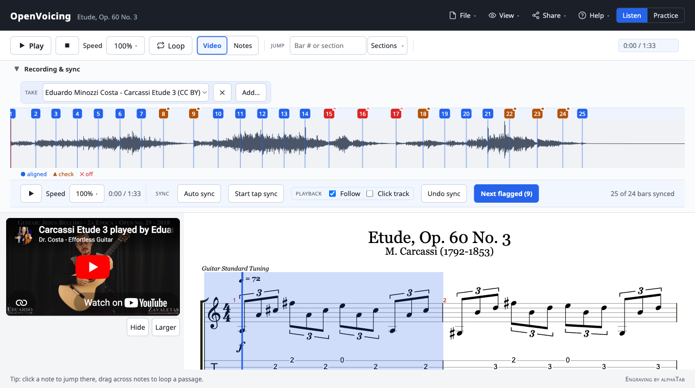

# OpenVoicing

**Living sheet music: notation that plays, slows down without changing pitch, and syncs to real recordings.**

[](https://github.com/pjdoland/openvoicing/actions/workflows/ci.yml)


OpenVoicing is an open alternative to commercial, hosted tools, built around an **open file
format instead of a hosted service**. The editor exports self-contained bundles
(`.ovb`) holding a score, its recordings, and the sync map that aligns them, and
the embeddable player plays those bundles from any static URL.

**[▶ Try the live demo](https://pjdoland.github.io/openvoicing/app/)** · [User guide](docs/user-guide.md) · [Docs](docs/index.md)



## Why OpenVoicing

- **Practice tools that matter** — slow a passage down without changing pitch, loop
  it, add a count-in, and follow a metronome.
- **Sync to real recordings** — line up a real audio performance, or a **YouTube
  video** (a lesson or a performance), with the score so playback follows the
  notation, bar by bar.
- **Own your files** — a `.ovb` bundle is self-contained and portable. No account,
  no lock-in; host and embed it anywhere.
- **Editable notation** — import MusicXML or Guitar Pro, edit the notes, and export.

## Who are you?

- **A musician?** → [Try the demo](https://pjdoland.github.io/openvoicing/app/), then the
  [user guide](docs/user-guide.md).
- **Hosting or embedding it?** → the [deployment & self-hosting guide](docs/deploy-app.md)
  and the [embed API](docs/embed-api.md).
- **Contributing?** → [CONTRIBUTING.md](CONTRIBUTING.md) and the
  [architecture overview](docs/architecture.md).

## Project status

**Early development (pre-1.0).** Expect breaking changes; see [PLAN.md](PLAN.md)
for direction and [CHANGELOG.md](CHANGELOG.md) for recent work.

| Component | State |
| --- | --- |
| `score-model`, `player`, `audio-engine`, `bundle` | Usable; APIs may still change |
| Authoring app + practice tools | Usable |
| Notation editor | Working, actively evolving |
| Embed SDK & `.ovb` format | Working; **not yet version-stable** — pin what you embed |
| Recording scanning (OMR), courses/teaching | Planned |

## What works today

- **Playback:** notation and tablature rendering with synth playback, built on
  [alphaTab](https://alphatab.net) behind a renderer-agnostic API.
- **Practice:** play/pause, loop, tempo control without pitch change, metronome,
  count-in.
- **Recordings:** open an audio file, see its waveform, sync it to the score, click
  to seek, drag to loop, slow it down without changing pitch — via the
  [Signalsmith Stretch](https://signalsmith-audio.co.uk/code/stretch/) AudioWorklet.
  Or sync a **YouTube video** and follow the notation as it plays (embedded via
  YouTube's player, never downloaded).
- **Editor:** MusicXML/Guitar Pro imports become editable documents; edit notes,
  voices, ornaments, dynamics, and lyrics; autosave; export MusicXML or a bundle.
- **Bundles & embedding:** the `.ovb` open format, the `ovb` CLI, and an
  embeddable player.

## Quickstart

Requires Node 22+ and pnpm.

```sh
pnpm install
pnpm dev        # demo app at http://localhost:5173
pnpm test       # unit tests
pnpm typecheck
pnpm build      # static site in apps/web/dist
```

## Embedding

Host a `.ovb` bundle on any static server, then add the player to any page:

```html
<script src="https://your-player-host/openvoicing-embed.js"></script>
<div data-openvoicing-bundle="https://example.com/tune.ovb"></div>
```

Or drive it from JavaScript:

```js
const player = OpenVoicing.create("#slot", { bundle: "https://example.com/tune.ovb" });
player.on("ready", (e) => console.log(e.title));
player.play();
player.setSpeed(0.5);
```

Full options, methods, and events: the [embed API reference](docs/embed-api.md).

## Command line

The `ovb` CLI creates and validates bundles:

```sh
pnpm --filter @openvoicing/bundle build
node packages/bundle/bin/ovb.mjs create --score song.musicxml --recording take.mp3 --out song.ovb
node packages/bundle/bin/ovb.mjs validate song.ovb
```

See the [CLI reference](docs/cli.md).

## Editing

Toggle **Edit**, then click a note and type. The editor is keyboard-first — press
**?** in the app for the full, always-current shortcut sheet, or read the
[user guide](docs/user-guide.md#keyboard-shortcuts).

## Documentation

Everything is indexed at [docs/index.md](docs/index.md):

- [User guide](docs/user-guide.md) — play, practice, sync, edit, share
- [Deployment & self-hosting](docs/deploy-app.md) · [Embed API](docs/embed-api.md) · [`ovb` CLI](docs/cli.md)
- [Bundle format spec](docs/bundle-format.md) · [Architecture](docs/architecture.md) · [Testing](docs/testing.md)
- [Contributing](CONTRIBUTING.md)

## Layout

```
packages/score-model   # document format, converters, sync maps
packages/player        # embeddable player
packages/audio-engine  # time-stretch playback, waveforms
packages/bundle        # .ovb bundle format: create, read, validate
apps/web               # authoring app + embeddable player page
docs/                  # documentation (docs/internal/ = design drafts)
```

## License

OpenVoicing is **MIT** licensed: use, modify, host, embed, and redistribute it,
including in commercial products, as long as you keep the copyright notice. A few
bundled third-party components (alphaTab under MPL-2.0, the fonts under OFL-1.1,
the FluidR3Mono soundfont under MIT) keep their own permissive notices. See
[LICENSING.md](LICENSING.md) and [THIRD-PARTY-NOTICES.md](THIRD-PARTY-NOTICES.md).
